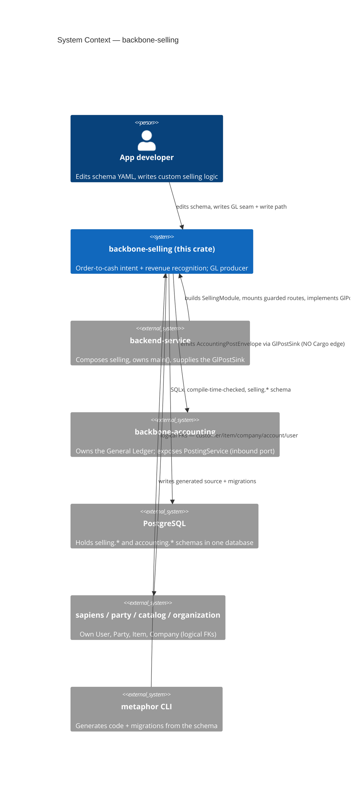
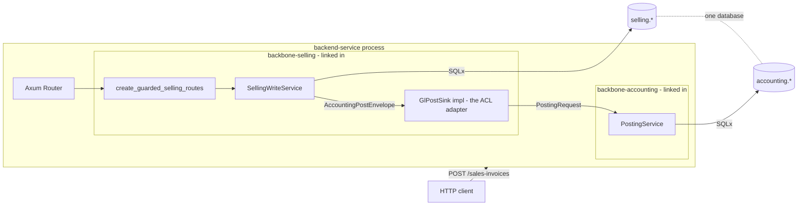
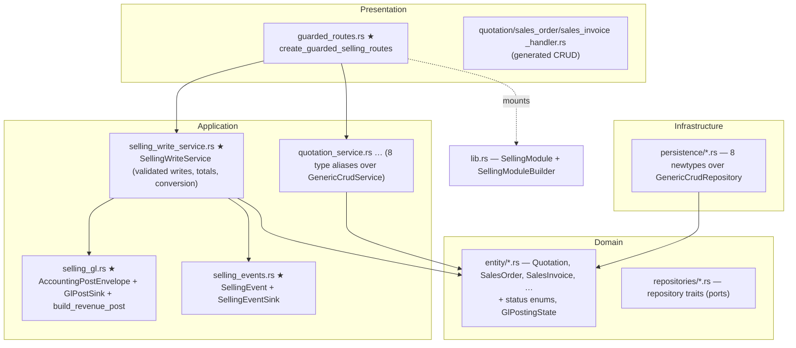

<!-- Reader: Maintainer · Mode: Explanation -->
# Architecture

`backbone-selling` is a **library crate** that owns the order-to-cash domain as four DDD layers. It
does not run on its own — a `backend-service` composes it, hands it a Postgres pool and a
`GlPostSink`, and mounts its router. Everything in `src/` is either generated from the schema YAML or
lives in a regen-safe custom region. This page shows the system top-down (C4), then traces a
revenue-recognising invoice post through all four layers and across the GL seam.

> **Composition root is `SellingModule` in [`src/lib.rs`](../../src/lib.rs).** Wire and read against
> `SellingModule` / `SellingModuleBuilder` — the builder that assembles all eight services from a
> Postgres pool. (An earlier skeleton `Module`/`Example` root and its `example_*` files have been
> removed.)

## 1. Context

Who uses selling, and what it depends on. Note every external system is a **logical reference**, not
a code dependency.



*What to notice: selling has an **edge to accounting through a trait**, never through a Cargo
dependency. `cargo tree -e normal -i backbone-accounting` on this crate is empty; the seam test
proves it. Identity, parties, items, and companies come from sibling modules by logical reference —
selling holds no masters.*

## 2. Containers

The runnable pieces. Selling compiles into the service binary; the ledger is a sibling module in the
same process and database.



*What to notice: the only path from selling into the ledger is `SellingWriteService → GlPostSink →
PostingService`. The `GlPostSink` implementation — the anti-corruption layer that maps envelope →
`PostingRequest` — lives in the **composing service** (or the seam test), never in selling. Both
schemas share one database and one connection, exactly as a composed service runs them.*

## 3. Components — the DDD 4-layer shape + the custom seam

Dependencies point **inward only**. Domain depends on nothing. The generated CRUD cake sits in the
layers; selling's hand-written value is the shaded custom files.


*★ = hand-written, `user_owned` in [`metaphor.codegen.yaml`](../../metaphor.codegen.yaml); regen never touches them.*

| Layer | Directory | Holds | May depend on |
|-------|-----------|-------|---------------|
| **Domain** | `src/domain/` | The eight entities (`Quotation`, `QuotationItem`, `SalesOrder`, `SalesOrderItem`, `SalesInvoice`, `SalesInvoiceItem`, `SalesTeam`, `SalesPersonAllocation`), the status enums (`QuotationStatus`, `SalesOrderStatus`, `SalesInvoiceStatus`, `GlPostingState`), the repository **traits** | nothing |
| **Application** | `src/application/` | Eight `…Service` type aliases; DTOs; **★ the write path** (`SellingWriteService`), **★ the GL seam** (`AccountingPostEnvelope`, `GlPostSink`, `build_revenue_post`), **★ the event surface** (`SellingEvent`, `SellingEventSink`) | domain |
| **Infrastructure** | `src/infrastructure/` | Eight repository newtypes over `GenericCrudRepository`; event store | domain, application |
| **Presentation** | `src/presentation/`, `src/routes/` | Generated CRUD handlers + read-route helpers; **★ `create_guarded_selling_routes`** | application |
| **Composition** | `src/lib.rs` | `SellingModule` / `SellingModuleBuilder`, public re-exports | all layers (it is the root) |

A subtlety worth internalizing: there are **two repositories per entity**. The domain layer defines a
repository **trait** (the *port*); the infrastructure layer defines a **newtype** over
`GenericCrudRepository` (the *adapter*). The port is the contract; the adapter is the Postgres
implementation.

## The three route surfaces — pick the right one

Selling exposes three mounts. This is the single most important architectural choice for a consumer:

| Mount | What it exposes | Use when |
|-------|-----------------|----------|
| **`create_guarded_selling_routes(&module, pool)`** ★ | Read all documents + **validated creates** (`POST /quotations`, `/sales-orders`, `/sales-orders/confirm`, `/sales-invoices`). Generic create/update/delete are **not** mounted. Totals computed server-side. | **Any real deployment.** This is the recommended surface. |
| **`SellingModule::all_crud_routes()`** | The full **unguarded** 12-endpoint CRUD on every entity. A well-formed request can write an invalid row or soft-delete a referenced master. | Trusted/admin/seeding contexts only. |
| **`SellingModule::routes()`** | Deprecated alias for `all_crud_routes()`. | Never — it is `#[deprecated]`. |

The GL-posting seam (`post_sales_invoice`) is **not an HTTP route** on any surface: it needs a
`GlPostSink` supplied by the composing service, so it is driven by the service layer / a posting job,
and proven by the seam integration test.

## 4. Data & control flow — posting a revenue invoice, end to end

Trace `SellingWriteService::post_sales_invoice(invoice_id, sink)` — the marquee path.

```mermaid
sequenceDiagram
    actor Caller as Service / posting job
    participant W as SellingWriteService
    participant DB as selling.sales_invoices
    participant B as build_revenue_post
    participant K as GlPostSink (ACL, in the service)
    participant PS as accounting.PostingService
    participant E as SellingEventSink

    Caller->>W: post_sales_invoice(invoice_id, &sink)
    W->>DB: SELECT posting_state, journal_id, accounting_post_id
    alt already posted
        DB-->>W: state = posted
        W-->>Caller: PostOutcome { idempotent_reuse: true } (no re-emit)
    else fresh post
        W->>B: build_revenue_post(invoice_id)
        Note over B: Dr A/R = total (w/ customer party)<br/>Cr Revenue per income account (BTreeMap order)<br/>Cr PPN Output = tax_amount (if > 0)<br/>refuses unbalanced; refuses non-IDR (422)
        B-->>W: balanced AccountingPostEnvelope (source_id = invoice_id)
        W->>K: sink.post(&envelope)
        K->>PS: PostingRequest (envelope → mapped)
        Note over PS: partial unique index<br/>(company, source_type, source_id, posting_type) WHERE posted<br/>→ exactly one journal, ever
        alt accepted
            PS-->>K: journal_id, post_id
            K-->>W: GlPostAck
            W->>DB: UPDATE posting_state=posted, status=submitted,<br/>journal_id, accounting_post_id, posted_at, outstanding=total
            W->>W: advance_billing_watermarks(invoice_id) → order to_bill/completed
            W->>E: publish SalesInvoicePosted
            W-->>Caller: PostOutcome { journal_id, post_id }
        else rejected
            PS-->>K: stable error code (e.g. non_postable_account)
            K-->>W: GlPostRejected
            W->>DB: UPDATE posting_state=failed
            W-->>Caller: Err(SellingError) — no journal written
        end
    end
```

*What to notice:*
- **Idempotency is not selling's guard — it is accounting's index.** Selling's posted-short-circuit
  and `posting_state <> 'posted'` clause are defense-in-depth; the arbiter is accounting's partial
  unique index on `source_id = invoice_id`. Two concurrent posts yield **one** journal
  ([`SEAM-2`](../business-flows/golden-cases.md)).
- **Document state and posting state move on the same ack but mean different things.**
  `status → submitted` is the document; `posting_state → posted` is the GL reconciliation.
- **A rejection writes nothing to the ledger.** The invoice goes `failed`; there is no partial post.

### The order-to-cash conversion path

`Quotation → SalesOrder → SalesInvoice` is driven by the same service:
`accept_quotation` → `convert_quotation_to_order` (refuses a non-accepted quotation with
`quotation_not_accepted`) → `confirm_sales_order` (sets the order `to_bill`) →
`create_invoice_from_order` → `post_sales_invoice` (advances each `SalesOrderItem.billed_qty` and
closes the order to `completed` when fully billed). The numeric oracle for this is
[`OTC-1`](../business-flows/golden-cases.md) in [`tests/order_to_cash.rs`](../../tests/order_to_cash.rs).

## Where persistence & lifecycle semantics come from

- **Soft delete** — `config.soft_delete: true` in [`index.model.yaml`](../../schema/models/index.model.yaml)
  → repositories operate on `metadata.deleted_at`; unique indexes are `WHERE deleted_at IS NULL` so a
  number can be reused after a soft delete.
- **Audit** — `config.audit: true` → the `metadata` JSONB (`created_at`, `updated_at`, `deleted_at`,
  `created_by`, `updated_by`, `deleted_by`); the `*_by` actors are logical FKs to `sapiens.User.id`,
  set by a trigger ([`…011_add_audit_triggers.up.sql`](../../migrations/20260426220011_add_audit_triggers.up.sql)).
- **Own schema** — `schema: selling` → migrations `CREATE SCHEMA selling` and qualify every table as
  `selling.<table>`, so selling and accounting never collide.
- **IDR-only invoices** — a hand-written, `user_owned` migration
  ([`…020_sales_invoice_idr_only_check`](../../migrations/20260426220020_sales_invoice_idr_only_check.up.sql))
  adds `CHECK (currency = 'IDR')` on `selling.sales_invoices` — a second guard behind
  `build_revenue_post`'s runtime check.

## Key decisions

Framework decisions (why the machine works this way):
- [ADR-0001](adr/adr-0001-schema-yaml-ssot.md) — schema YAML is the single source of truth.
- [ADR-0002](adr/adr-0002-generic-crud.md) — services/repositories are generic, inherited not written.
- [ADR-0003](adr/adr-0003-custom-markers.md) — regen-safety via CUSTOM markers and `user_owned`.

Selling domain decisions (why *this* module is shaped this way):
- [ADR-001](../adr/ADR-001-selling-boundary.md) — three documents; selling is a GL producer, holds no masters.
- [ADR-002](../adr/ADR-002-gl-posting-seam.md) — the envelope + `GlPostSink` ACL; idempotent, IDR-only.
- [ADR-003](../adr/ADR-003-order-status-model.md) — the 7-state order model; billing live, delivery dark.

---

Next: [Maintainer Guide](05-maintainer-guide.md) — how to add a feature to selling without breaking
the machine.
